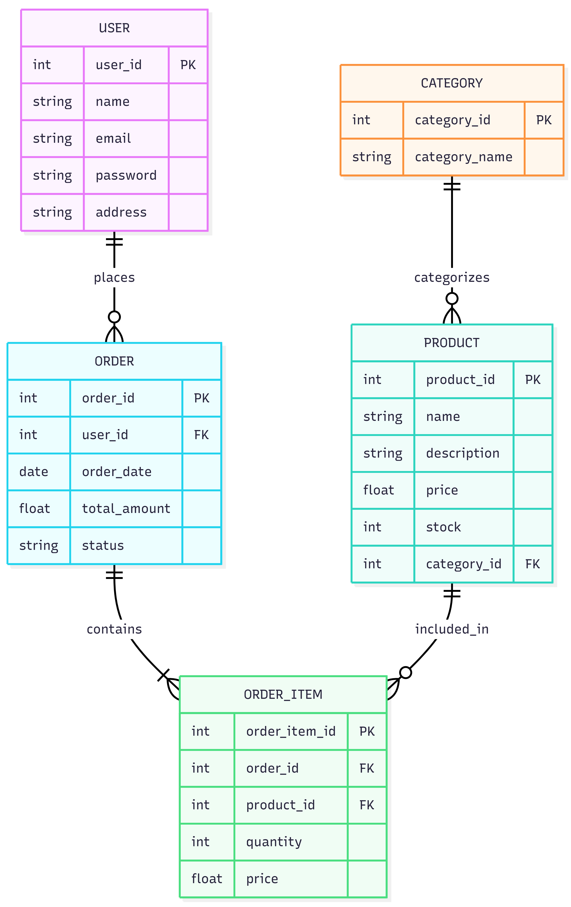

# E-Commerce Database Project

## 📌 Project Overview
This project is a simple E-Commerce database system designed using PostgreSQL.

The database simulates the backend structure of an e-commerce platform like Amazon or Nykaa.

It includes:
- Users
- Categories
- Products
- Orders
- Order Items

---

## 🛠 Technologies Used
- PostgreSQL
- SQL
- VS Code
- pgAdmin

---

## 📂 Project Files

### schema.sql
Contains all CREATE TABLE statements.

### insert_data.sql
Contains sample data inserted into tables.

### queries.sql
Contains SELECT queries to view data.

### er_diagram.png
ER diagram representing relationships between tables.

---

## 🗃 Database Tables

### Users
Stores customer information.

### Category
Stores product categories.

### Product
Stores product details and category references.

### Orders
Stores order information placed by users.

### Order_Item
Stores products included in each order.

---

## 🔗 Relationships
- One user can place many orders.
- One category can contain many products.
- One order can contain many products.
- One product can appear in many orders.

---

## 🚀 Features
- Relational database design
- Primary and foreign keys
- Sample e-commerce data
- SQL queries for data retrieval

---

## 📖 Learning Outcome
This project helped in understanding:
- ER diagrams
- SQL table creation
- Foreign key relationships
- Data insertion
- Query execution in PostgreSQL

---

## 🖼 ER Diagram

